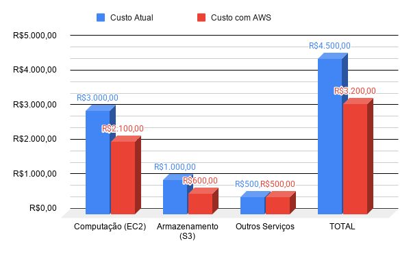

# RELATÓRIO DE IMPLEMENTAÇÃO DE SERVIÇOS AWS

- Data: 26 de abril de 2026
- Empresa: Abstergo Industries
- Responsável: Matheus Maia

## Introdução
Este relatório apresenta o processo de implementação de ferramentas na Abstergo Industries, realizado por Matheus Maia, visando a otimização da infraestrutura em nuvem. O objetivo central é elencar 3 serviços AWS estratégicos que proporcionam redução de custos imediatos e maior eficiência operacional através da gestão inteligente de recursos.

## Descrição do Projeto
O projeto foi estruturado em três frentes de atuação, focadas em controle de gastos e automação de recursos ociosos.

Etapa 1: Visibilidade e Governança
- AWS Cost Explorer
- Análise de tendências de custos e identificação de anomalias.
- Implementação de dashboards personalizados para monitorar o consumo diário da infraestrutura. O objetivo é identificar quais departamentos ou instâncias estão gerando maiores picos de custo, permitindo a criação de alertas de orçamento (Budgets) para evitar surpresas no fechamento da fatura mensal.

Etapa 2: Otimização de Armazenamento
- Amazon S3 Lifecycle Policies
- Gestão automática do ciclo de vida de dados.
- Configuração de políticas automáticas para mover objetos acessados com pouca frequência (logs antigos, backups de meses anteriores) para classes de armazenamento de custo reduzido, como S3 Standard-IA ou S3 Glacier. Isso elimina o custo de manter dados frios em armazenamento de alta performance.

Etapa 3: Eficiência Computacional
- AWS Auto Scaling
- Dimensionamento dinâmico de instâncias EC2.
- Configuração de grupos de Auto Scaling para ajustar automaticamente o número de instâncias com base na demanda real (CPU/Memória). Em horários de baixa carga, o serviço reduz o número de instâncias ativas, garantindo que a empresa pague apenas pelo poder computacional que está utilizando.


## Conclusão
A implementação destes serviços na Abstergo Industries resultará em um controle financeiro proativo, com expectativa de redução de até 30% nos custos operacionais mensais de nuvem logo nos primeiros períodos de medição. A automação das políticas de armazenamento e o dimensionamento dinâmico permitirão que a equipe foque em inovação, em vez de manutenção reativa. Recomenda-se a revisão trimestral das políticas implementadas para ajustes finos baseados no crescimento da empresa.

## Anexos

### Anexo 1: Estimativa de Economia

**Objetivo:** Demonstrar a projeção de economia de custos operacionais e o retorno sobre o investimento (ROI) alcançado com a otimização da infraestrutura.



### Anexo 2: Configuração de Alertas (AWS Budgets)

**Objetivo:** Estabelecer alertas automáticos para controle proativo de gastos e evitar surpresas na fatura.

**Procedimento de Configuração:**
1. **Acesso:** Navegue até *Billing and Cost Management* > *Budgets*.
2. **Definição:** Criar *Cost Budget* com o valor mensal definido no planejamento financeiro.
3. **Limiares de Alerta:**
   - **80% do Orçamento:** E-mail de aviso para o Administrador Financeiro (análise preventiva).
   - **100% do Orçamento:** E-mail crítico para Gestão de TI e Financeiro (intervenção imediata).

### Anexo 3: Auditoria das Políticas de Ciclo de Vida (S3)

**Objetivo:** Reduzir custos de armazenamento movendo dados inativos (backups/logs) para a classe *S3 Glacier* após 30 dias.

**Especificação da Política (JSON para Auditoria):**

```json
{
  "Rules": [
    {
      "ID": "MoverLogsParaGlacier",
      "Status": "Enabled",
      "Filter": {
        "Prefix": "backups-logs/"
      },
      "Transitions": [
        {
          "Days": 30,
          "StorageClass": "GLACIER"
        }
      ]
    }
  ]
}
```
### Anexo 4: Parâmetros de Eficiência (Auto Scaling)

**Objetivo:** Garantir escalabilidade horizontal mantendo a performance do sistema de farmácia dentro do orçamento.

**Procedimento de Configuração:**
- **Métrica de Referência:** Average CPU Utilization (Alvo: 60%).
- **Capacidade Mínima:** 1 instância (garante o sistema sempre online).
- **Capacidade Máxima:** 3 instâncias (limite para evitar custos inesperados em picos anômalos).
- **Cooldown:** 300 segundos (evita instabilidade no escalonamento).

------

Assinatura do Responsável pelo Projeto:

Matheus Maia
